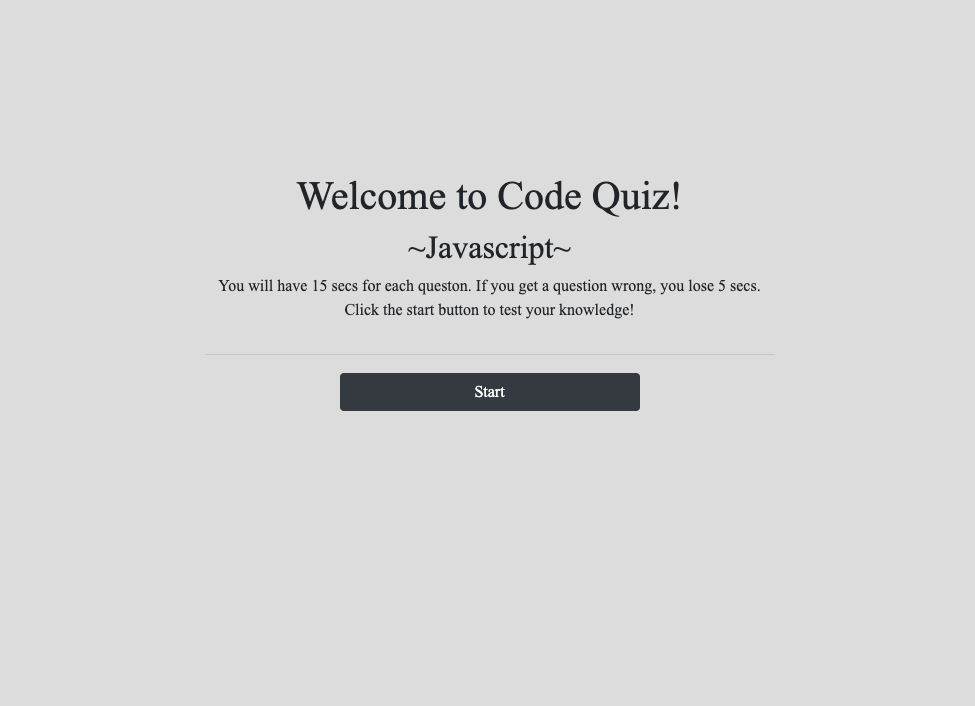
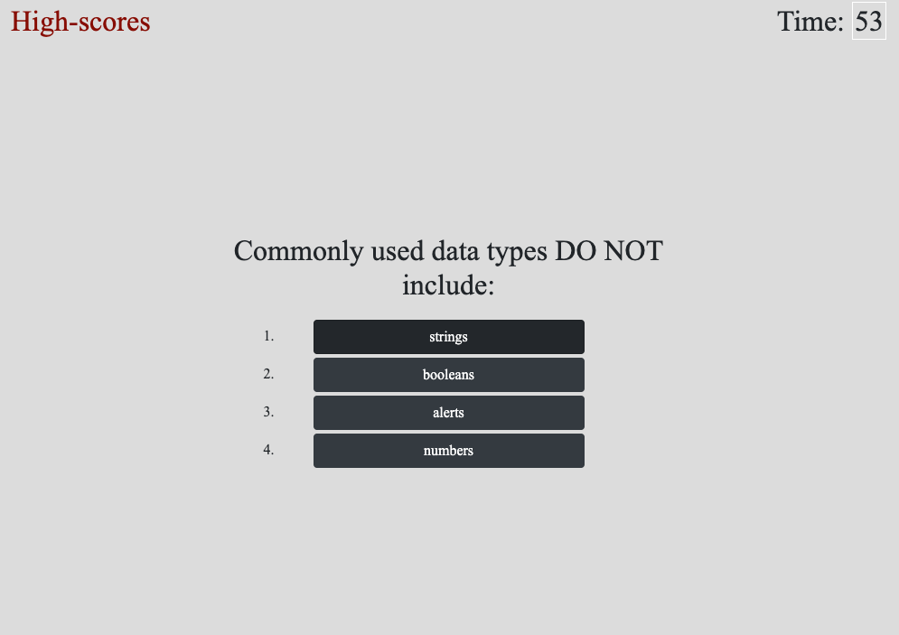
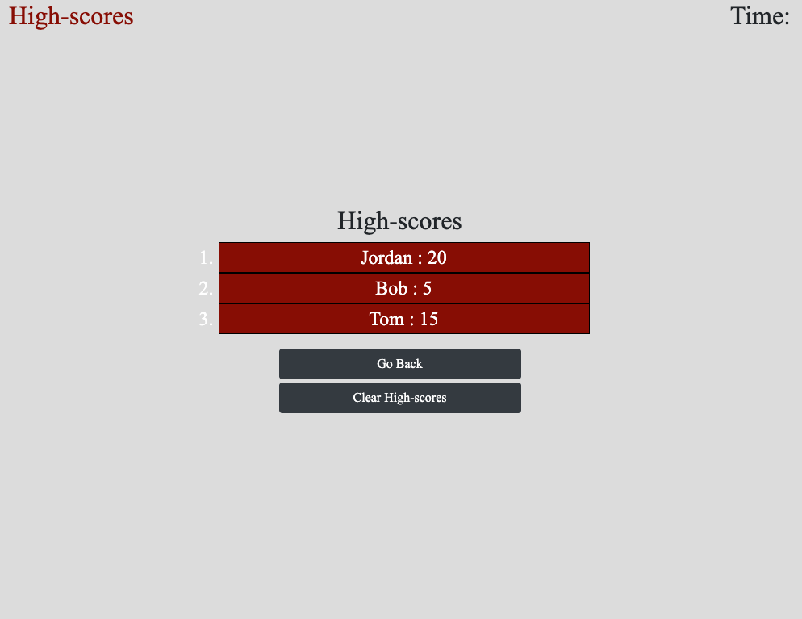

# Code-Quiz

This application is a timer-based quiz application that stores high scores 
client-side. If you get a wrong answer, timer decreases by 5 seconds. Final
score is saved into local storage with your initials.

## Deployed URL

[Code-Quiz](https://jordancley.github.io/Code-Quiz/)

## Author

* **Jordan McQuiston** 
